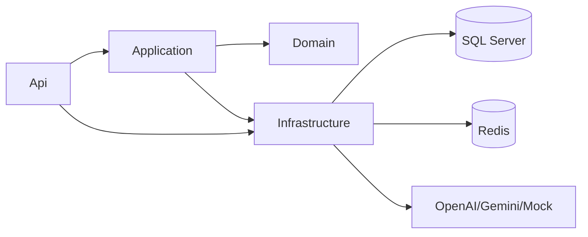
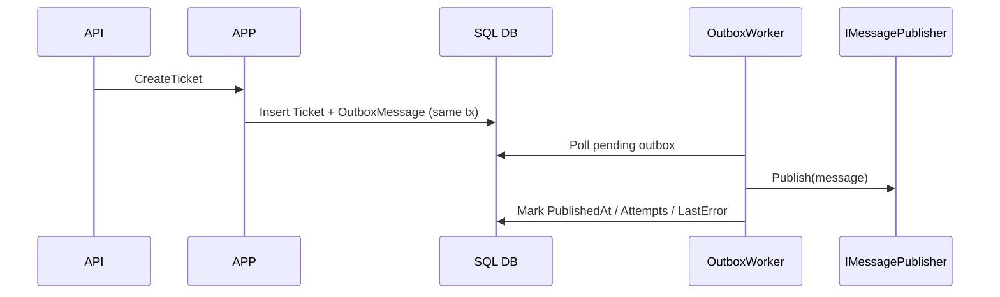
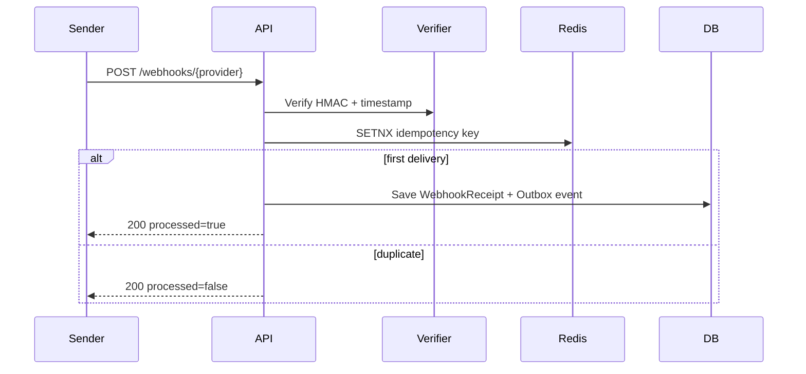

# ai-native-clean-architecture-starterkit

Production-grade **.NET 8** backend starter for **Clean Architecture + DDD**, with AI abstraction, domain events, transactional outbox, secure webhooks, and observability.

## What this repository is for
- Fast bootstrap for internal platforms or product teams building AI-enabled backends.
- Opinionated boundaries to evolve from modular monolith to microservices.
- Reliable integrations via Outbox pattern and idempotent webhook ingestion.

## Architecture Overview


### Layer responsibilities
- **Domain**: Ticket aggregate, invariants, domain events.
- **Application**: Commands/queries, validation, abstractions, pipeline behaviors.
- **External boundaries (abstracted)**: AI client, clock, message publisher, external HTTP client, email sender.
- **Infrastructure**: EF Core persistence, AI clients, outbox writer/publisher, webhook verifier, Redis cache, OpenTelemetry wiring.
- **API**: Minimal APIs, auth middleware, ProblemDetails, DI composition root.

## Project Structure
- `src/Api`
- `src/Application`
- `src/Domain`
- `src/Infrastructure`
- `src/SharedKernel`
- `tests/UnitTests`
- `tests/IntegrationTests`

## Domain: Support Triage
- Aggregate: `Ticket`
- Events: `TicketCreated`, `TicketClassified`, `TicketAssigned`
- Rules enforced:
  - title required, <= 200
  - valid email
  - classify only when status is `New`

## Implemented Use Cases
1. `POST /tickets` -> `CreateTicketCommand` and transactional outbox write.
2. `POST /tickets/{id}/classify` -> AI classification with abstraction + audit log.
3. `POST /webhooks/{provider}` -> signature validation + idempotency key handling.
4. Background outbox publisher worker publishes pending messages.

## Outbox Sequence


## Webhook Idempotency Sequence



## Feature Status Checklist
- [x] Clean Architecture + DDD boundaries
- [x] Domain events in aggregate lifecycle
- [x] Transactional Outbox (same DbContext transaction path)
- [x] Background outbox publisher with claim/lock flag for multi-instance safety
- [x] Webhook HMAC verification + timestamp tolerance
- [x] Webhook idempotency using Idempotency-Key or payload `id`
- [x] AI provider abstraction (Mock/OpenAI/Gemini)
- [x] AI call timeout + exponential backoff retries in classify use case
- [x] AI audit logs persisted
- [x] OpenTelemetry traces + metrics + Serilog
- [x] API key auth option for non-webhook endpoints
- [x] Docker compose for local stack
- [x] Unit + integration tests

## How to switch AI providers
Set `Ai__Provider` to one of:
- `Mock` (default for local dev)
- `OpenAI`
- `Gemini`

Tool-calling readiness is exposed through `IAiClient.InvokeWithToolsAsync(...)` so providers can execute registered tools in a provider-agnostic way.

## Configuration
Use env vars:
- `ConnectionStrings__Default`
- `Redis__ConnectionString`
- `Ai__Provider` (`OpenAI|Gemini|Mock`)
- `Ai__OpenAI__ApiKey`, `Ai__Gemini__ApiKey`
- `Webhooks__Providers__{provider}__Secret`
- `ApiKeyAuth__Enabled`, `ApiKeyAuth__Key`
- `Messaging__UseRabbitMq`, `Messaging__RabbitMq__Host`, `Messaging__RabbitMq__Exchange`

## Run locally (Docker)
```bash
docker compose up --build
```
API: `http://localhost:8080`, Swagger at `/swagger`.

## Run tests
```bash
dotnet test ai-native-clean-architecture-starterkit.sln
```

## Commands
```bash
# build
dotnet build ai-native-clean-architecture-starterkit.sln

# test
dotnet test ai-native-clean-architecture-starterkit.sln

# run without docker
dotnet run --project src/Api/Api.csproj
```

## Observability
- OpenTelemetry traces/metrics enabled with console exporter.
- Serilog structured logs.
- EF Core, ASP.NET, and HttpClient instrumentation configured.

## Notes on persistence approach
This starter uses **EF Core DbContext via `IApplicationDbContext` abstraction** in application handlers (no custom repository layer) to keep handlers explicit while preserving infrastructure isolation.

## Roadmap
- Multi-tenant partitioning.
- Saga/process manager examples.
- RabbitMQ publisher implementation toggle (now available via config flag).
- Inbox pattern for consumer idempotency.


## Initial request audit
See `docs/InitialRequestAudit.md` for a final requirement-by-requirement checklist.
